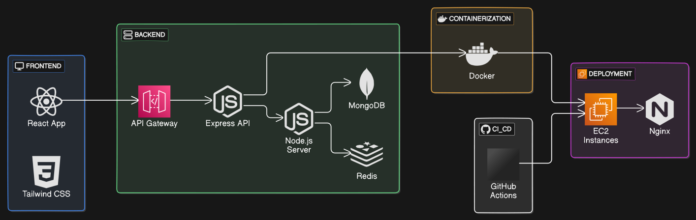

## 📐 System Design

 


## 🛠️ Tech Stack


<div align="center">

### Languages


### Frameworks


### Databases


### Services


</div>


## 🛠️ Prerequisites

- [Node.js](https://nodejs.org/) installed on your machine 🟩
- [Git](https://git-scm.com/) installed on your machine 🐙


## ⚙️ Installation


1. **Install All Dependencies 🚢**

     ```bash
     pnpm install:all
     ```
2. **Run Project 🚢**

     ```bash
     pnpm dev:all
     ```     
3. **Run Frontend 🚢**

     ```bash
     pnpm dev:frontend
     ```       
4. **Run Frontend 🚢**

     ```bash
     pnpm dev:backend
     ```         

## ❤️ Contributing

We welcome contributions to UNITE!

To get started, please check out the [CONTRIBUTING.md](./CONTRIBUTING.md) file for guidelines on how to contribute. Here are some key points:

- **Create a new branch from your fork for any changes you make.**

- **Always Contribute in dev branch.**

- **If you're adding a new features, please add it inside the `apps` directory.**

- **If you're working on the documentation website, please work inside the `docs` directory _._**

**_Note: If contributions do not follow the guidelines specified in the [CONTRIBUTING.md](./CONTRIBUTING.md) file, the pull request will not be accepted ❌._**

<h2 align = "center">Contributors of Unite 🚀</h2>
<div align = "center">
<a href="https://github.com/Bug-Bust3rs/UNITE/graphs/contributors">
  
</a>
</div>
